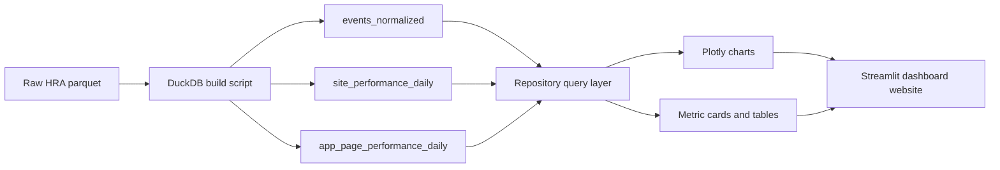

# Architecture

## Goal

The project converts one large raw parquet log file into a reproducible analytical database and then renders the client-facing website from that database.

## Data flow

## Raw source

The source dataset is the HRA combined CloudFront log parquet:

- request logs for Portal, KG, CDN, API, Apps, and Events
- event telemetry embedded in the `query` map for `site = 'Events'`
- cache and latency fields such as `x_edge_result_type`, `time_to_first_byte`, and `time_taken`

## DuckDB layer

The DuckDB build is handled by [`build_duckdb.py`](/Users/cinhtw/Documents/Playground/scripts/build_duckdb.py) and [`duckdb_builder.py`](/Users/cinhtw/Documents/Playground/src/humanatlas_dashboard/duckdb_builder.py).

### Derived table: `events_normalized`

Purpose:

- isolate behavior-relevant `Events` rows
- exclude `Bot` and `AI-Assistant / Bot`
- normalize the core tracking fields for downstream analysis

Key extracted fields:

- `session_id`
- `app_name`
- `event_name`
- `ui_path`
- `path_source`
- `event_value`
- `page_url`
- `page_title`

Important implementation detail:

- `ui_path` is extracted as `COALESCE(path, e.path)` because older and newer instrumentation use different keys

### Derived table: `site_performance_daily`

Purpose:

- summarize request volume, cache-served rate, misses, errors, and latency per day per HRA site

Cache rule:

- requests with `x_edge_result_type IN ('Hit', 'RefreshHit')` are treated as cache-served

### Derived table: `app_page_performance_daily`

Purpose:

- summarize app-level cache and latency for pages served from `apps.humanatlas.io`

App names are derived from the first URL path segment and mapped to readable labels in the config file.

## Application layer

The query layer lives in [`data_access.py`](/Users/cinhtw/Documents/Playground/src/humanatlas_dashboard/data_access.py). It is responsible for:

- applying the event-app and date filters consistently
- computing the research-question-specific aggregates
- exposing dedicated methods for each tab

## Presentation layer

The dashboard is rendered from:

- [`dashboard.py`](/Users/cinhtw/Documents/Playground/app/dashboard.py)
- [`sections.py`](/Users/cinhtw/Documents/Playground/src/humanatlas_dashboard/sections.py)
- [`charts.py`](/Users/cinhtw/Documents/Playground/src/humanatlas_dashboard/charts.py)

Each tab follows the same pattern:

1. methodological framing
2. KPI row
3. one or more charts
4. supporting detail table

## Why this architecture is easy to update

If the client changes the exact graph list later:

- update the query methods in the repository
- add or swap chart render calls in the section renderer
- leave the raw-to-DuckDB normalization intact

That means the expensive and brittle part, decoding the raw HRA event structure, is already centralized.
